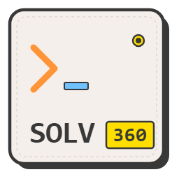
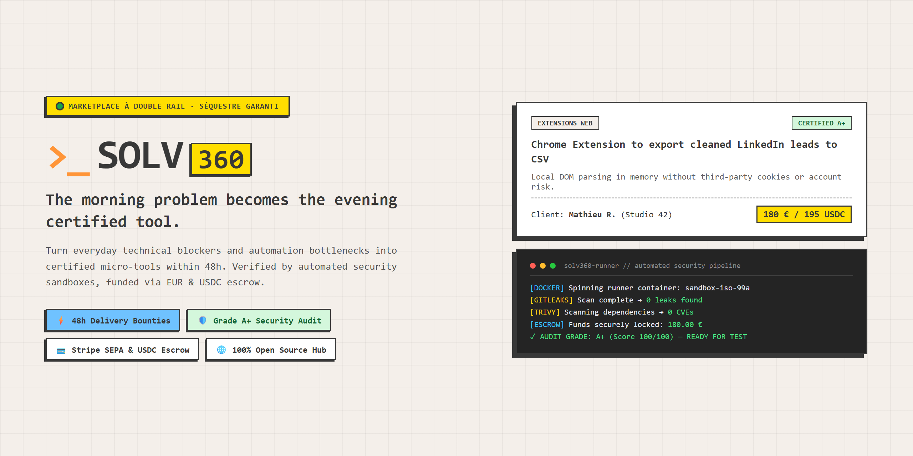
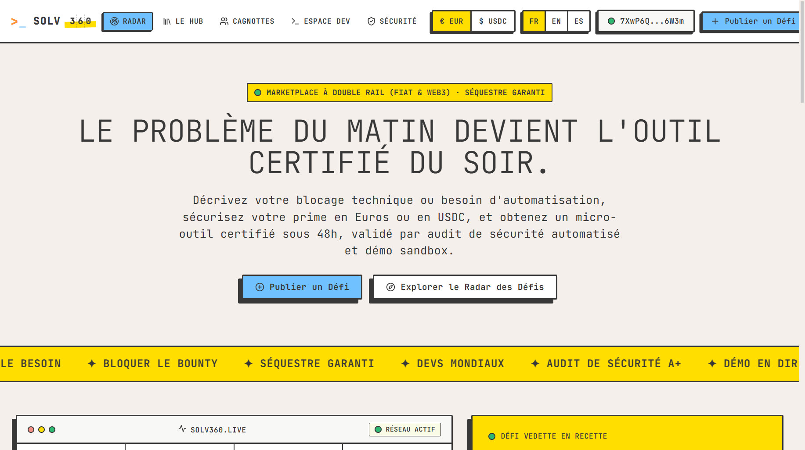
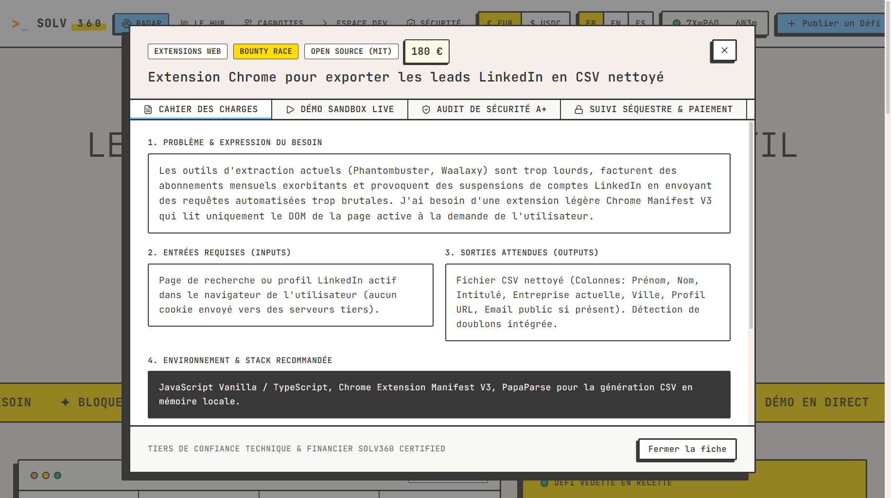
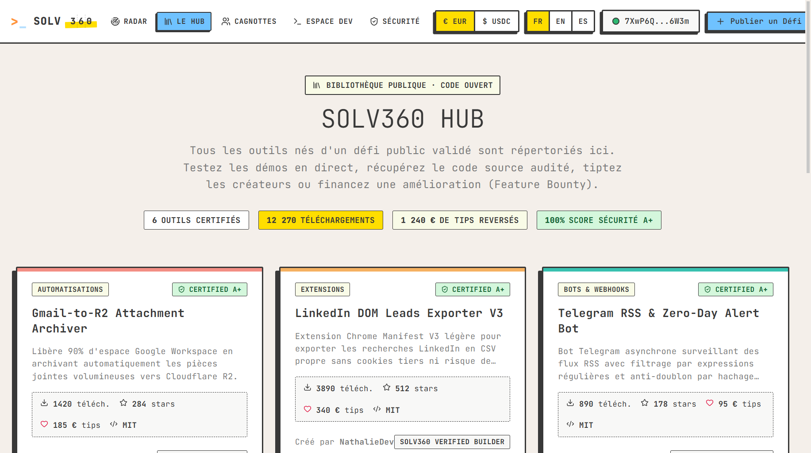
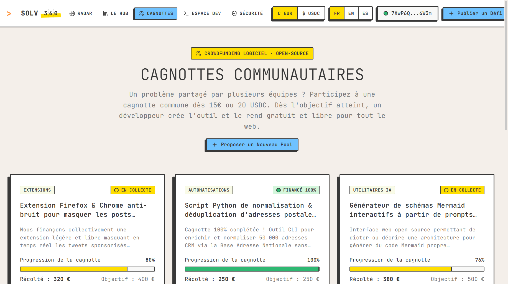

# Solv360

**Micro-software bounty marketplace with automated security audits and dual-rail escrow.** 
<em>Marketplace de micro-défis logiciels avec audit de sécurité automatisé et séquestre garanti.</em>

  

<a href="#pitch">Pitch & Vision</a> • <a href="#english">English</a> • <a href="#français">Français</a> • <a href="PITCH.md">📄 Lire le Pitch Complet</a> • <a href="https://solv360-showcase.vercel.app">🚀 Demander un Accès Pilote</a>

---

> [!NOTE]
> **Showcase Repository**: This public repository serves as the official product showcase, architecture overview, and documentation for **Solv360**. The core production backend, matching algorithms, runner isolation environments, and smart escrow contracts are maintained in a secure private repository to safeguard platform intellectual property.
>
> 🌐 **Interactive Live Product**: You can test the full user experience, interactive sandboxes, and multilingual interface directly on our production deployment: **[https://solv360-showcase.vercel.app](https://solv360-showcase.vercel.app)**.
>
> 🚀 **Join the Pilot Program**: Request your priority beta invitation directly through the interactive showcase top bar.

---

## Le Pitch Fondateur / Executive Pitch

> **« Le problème du matin devient l'outil certifié du soir. »**  
> *Solv360 est la première plateforme de micro-défis logiciels (bounties) avec double rail financier (EUR / USDC), audit de sécurité automatisé et règlement sécurisé après recette.*  
> 📄 **Dossier de présentation complet : [PITCH.md](PITCH.md)**

### Qui sommes-nous ?
**Solv360** est une infrastructure technologique conçue pour éliminer les lenteurs et les coûts exorbitants du développement sur-mesure. Nous réunissons une communauté mondiale de développeurs qualifiés (*Super-Builders*) et des professionnels ayant des besoins d'automatisation précis (scripts, bots, scrapers, extensions, micro-apps) pour une livraison garantie sous 48 heures.

### Ce que nous faisons
Nous transformons un blocage technique identifié le matin en un outil logiciel opérationnel et sécurisé le soir même :
1. **Expression du besoin** : Vous décrivez votre besoin technique en langage simple et définissez librement le montant de votre prime selon la valeur de l'outil.
2. **Protection préalable des fonds** : Le budget est provisionné en amont (en Euros par Stripe ou en USDC sur Base/Solana). Le développeur a la certitude que les fonds sont réservés.
3. **Prise en charge rapide** : Un builder qualifié développe l'outil ou concourt dans une *Bounty Race*.
4. **Audit de sécurité automatisé Grade A+** : Le code est scanné en environnement conteneurisé isolé (détection de clés, audit CVE, analyse statique SAST).
5. **Test en Sandbox interactive** : Vous testez l'outil directement dans votre navigateur sur des données d'essai avant toute validation financière.
6. **Règlement instantané** : D'un clic, vous validez la recette. Le développeur est rémunéré immédiatement et vous récupérez le livrable.

### Nos 5 Points Forts & Différenciateurs
- **Double Rail Financier (EUR & Web3 USDC)** : Zéro exclusion bancaire internationale, paiements débloqués en 2 secondes partout dans le monde avec des frais dérisoires en stablecoins.
- **Audit de Sécurité Automatisé Grade A+** : Triple scan conteneurisé éliminant tout malware, fuite d'API ou faille d'injection OWASP.
- **Paiement Sécurisé Conditionné à la Recette** : Les fonds ne sont libérés qu'après vérification concrète et approbation de l'acheteur.
- **3 Formats de Défis Flexibles** : *1-à-1 Express* (livraison 48h), *Bounty Race* (hackathon compétitif sur prototype) et *Cagnottes Partagées* (crowdfunding mutualisé pour financer un outil commun).
- **Le Hub Open Source & Tipping** : Les défis communautaires alimentent un catalogue d'outils libres (MIT / Apache-2.0) avec pourboires directs aux créateurs et financement de nouvelles fonctionnalités (*Feature Bounties*).

---

## English

### Executive Summary

Every software team encounters recurring, acute technical bottlenecks:
- A custom data export from LinkedIn or Salesforce that requires manual copy-pasting every week.
- An unmaintained scraper breaking on every DOM change.
- A missing webhook bridge between GitHub commits, Linear tickets, and Discord announcements.
- Expensive monthly subscriptions for simple utilities that require fewer than 100 lines of clean code.

Traditional freelance platforms suffer from bidding overhead, opaque qualification, protracted negotiations, payment dispute friction, and unvetted code security risks.

**Solv360** standardizes and accelerates this workflow:
1. **Clear Problem Framing**: The client posts an explicit ticket with verified input/output criteria and provisions the bounty (EUR via Stripe Connect or USDC on Base/Solana).
2. **48-Hour Sprint**: A verified builder claims the bounty (or enters a *Bounty Race*).
3. **Automated Zero-Trust Security Gate**: The submitted code is built and tested in an isolated container runner with strict SAST, dependency vulnerability scanning, and secret leak detection.
4. **Interactive Sandbox Testing**: The client tests the live working prototype in an isolated browser sandbox before releasing payment.
5. **Instant Dual-Rail Settlement**: Funds are released immediately to the developer upon verified delivery, with 100% intellectual property transfer or open-source community release.

---

### Core Platform Capabilities

| Module | Architectural Overview | Value Delivered |
| :--- | :--- | :--- |
| **Bounty Radar** | Live marketplace feed categorizing micro-challenges by domain (Automations, Bots, Extensions, Scraping, Micro-Apps, AI Utilities). | Real-time discovery with instant filtering by status, bounty size, and licensing mode. |
| **Dual-Rail Settlement Engine** | Hybrid settlement pipeline supporting SEPA fiat banking via Stripe Connect and decentralized stablecoin escrows (USDC). | Eliminates counterparty payment risk for both international developers and enterprise clients. |
| **Solv360 Certified Pipeline** | Ephemeral runner executing Gitleaks (token leak prevention), Trivy (CVE audit), and Semgrep (static analysis). | Guarantees that no malicious binaries, hidden miners, or unauthenticated egress connections enter production. |
| **Interactive Sandbox Simulator** | In-browser isolated execution sandbox allowing clients to test tools with sample data before approving payout. | Eliminates "works on my machine" disputes; provides instant proof of functionality. |
| **Open Source Hub** | Public repository cataloging certified MIT/Apache-2.0 micro-tools delivered through community-funded bounties. | Direct developer tipping and crowdfunding for feature bounties (Feature Requests). |
| **Community Pools** | Multi-funder crowdfunding pots allowing multiple teams with the same blocker to pool micro-contributions. | Drastically reduces development cost per team while financing free open-source software. |

---

### Visual Walkthrough

| Radar & Bounties Marketplace | Challenge Inspector & Security Audit |
| :---: | :---: |
|  |  |
| **The Hub (Open Source Directory)** | **Community Crowdfunding Pools** |
|  |  |

---

## Français

### Le problème du matin devient l'outil certifié du soir

**Solv360** est l'infrastructure de micro-bounties logiciels conçue pour éliminer les frictions d'externalisation technique.

Plutôt que d'engager des démarches lourdes sur des plateformes de freelances généralistes ou de souscrire à des abonnements disproportionnés, Solv360 permet à toute organisation de transformer un blocage technique identifié le matin en un utilitaire certifié et opérationnel le soir même.

#### Les 5 Piliers Fondateurs :
1. **Cahier des charges standardisé** : Expression claire des entrées (inputs), sorties attendues (outputs) et critères d'acceptation.
2. **Sécurisation des fonds avant le démarrage** : Montant de la prime provisionné dès la publication (SEPA ou USDC). Paiement garanti au développeur dès validation.
3. **Audit de sécurité systématique** : Validation automatisée en conteneur éphémère (détection de clés d'API exposées, audit de dépendances, analyse statique de code).
4. **Recette en bac à sable** : Test du prototype en direct dans le navigateur sans exécuter de binaires inconnus sur son poste de travail.
5. **Cession de propriété ou Open-Source** : Transfert de droits exclusifs pour les tickets privés, ou publication libre pour le bien commun au sein du Hub Solv360.

---

### Architecture & Modèle Économique

- **Commission au succès** : Frais de plateforme prélevés uniquement lors de la réussite de la transaction et validation du livrable par le client.
- **Double rail de paiement** :
  - **Rail Institutionnel** : Stripe Connect Escrow (cartes de crédit, virements bancaires SEPA B2B).
  - **Rail Décentralisé** : Smart contracts de séquestre sur Base et Solana (règlement en stablecoin USDC instantané, sans frontière bancaire).
- **Formules Adaptées** : Compte standard sans abonnement, formule *Builder Pro* pour les développeurs récurrents (commission préférentielle et alertes prioritaires), et offre *Entreprise* avec conciergerie dédiée.

---

### Propriété Intellectuelle & Licence

L'architecture, le design visuel néo-brutaliste, les marques et les concepts de la plateforme **Solv360** sont protégés par le droit de la propriété intellectuelle.
Tous droits réservés © 2026 Solv360. Voir [LICENSE](LICENSE).

Les outils créés et livrés par la communauté sur le **Hub Solv360** sont quant à eux distribués sous licences libres permissives (**MIT** ou **Apache 2.0**) au bénéfice du web ouvert.

---

### Contact & Programme Pilote

- **Showcase Public & Accès Pilote** : [https://solv360-showcase.vercel.app](https://solv360-showcase.vercel.app)
- **Partenariats & Inscriptions Bêta** : contact@solv360.com
